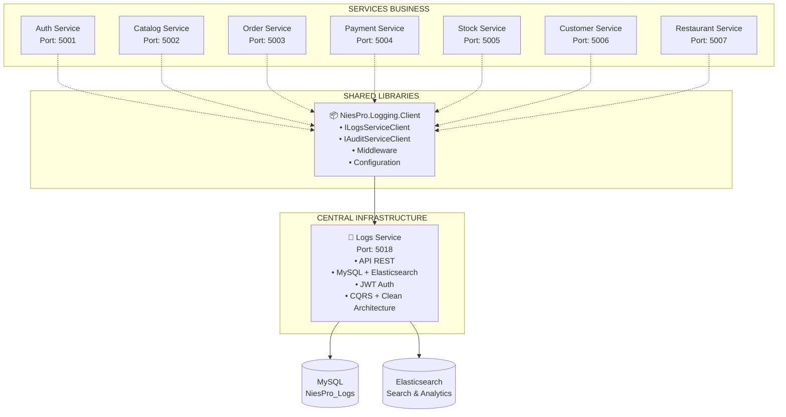

# 📊 Architecture Logging NiesPro - Service vs Client

## 🎯 Vue d'ensemble

Excellente question ! Cette architecture suit le pattern **Service-Client** classique en microservices. Voici les rôles distincts et complémentaires :

---

## 🏗️ **1. Logs Service** (`src/Services/Logs/`)

### **Rôle : SERVEUR CENTRALISÉ**
C'est le **microservice central** qui gère physiquement les logs de tout l'écosystème NiesPro.

#### 📋 **Responsabilités :**
```
┌─────────────────────────────────────────────────────────────┐
│                    🎯 LOGS SERVICE                          │
├─────────────────────────────────────────────────────────────┤
│ • STOCKER tous les logs des microservices                  │
│ • EXPOSER une API REST pour recevoir/consulter les logs    │
│ • TRAITER et INDEXER les logs (recherche, filtres)        │
│ • GÉRER l'audit trail et la traçabilité                   │
│ • FOURNIR les métriques et analytics                      │
│ • ASSURER la persistance (MySQL + Elasticsearch)          │
│ • SÉCURISER l'accès (JWT Authentication)                  │
│ • MAINTENIR les Health Checks du logging                  │
└─────────────────────────────────────────────────────────────┘
```

#### 🔧 **Architecture technique :**
- **Clean Architecture** + **CQRS**
- **Contrôleurs** : LogsController, AuditsController
- **Domain** : LogEntry, AuditEntry entities
- **Infrastructure** : Repositories, Database
- **Port** : 5018 (https://localhost:5018)
- **Base de données** : MySQL + Elasticsearch

#### 📡 **API exposée :**
```http
POST   /api/logs              # Créer un log
GET    /api/logs              # Récupérer logs avec filtres
GET    /api/logs/service/{name} # Logs par service
GET    /api/logs/search       # Recherche full-text
POST   /api/audits            # Créer audit
GET    /api/audits/{userId}   # Audits par utilisateur
```

---

## 🔌 **2. NiesPro.Logging.Client** (`src/Shared/NiesPro.Logging.Client/`)

### **Rôle : BIBLIOTHÈQUE CLIENT**
C'est la **bibliothèque partagée** que TOUS les microservices intègrent pour communiquer avec le service Logs.

#### 📋 **Responsabilités :**
```
┌─────────────────────────────────────────────────────────────┐
│                🔌 LOGGING CLIENT                            │
├─────────────────────────────────────────────────────────────┤
│ • SIMPLIFIER l'intégration pour les services               │
│ • FOURNIR les interfaces standardisées                     │
│ • GÉRER les appels HTTP vers le service Logs              │
│ • OFFRIR le middleware automatique de logging              │
│ • CONFIGURER les Health Checks                            │
│ • ASSURER la résilience (retry, fallback)                 │
│ • MAINTENIR la cohérence des contrats                     │
└─────────────────────────────────────────────────────────────┘
```

#### 🔧 **Composants fournis :**
1. **Interfaces standardisées** :
   - `ILogsServiceClient` - Logging applicatif
   - `IAuditServiceClient` - Audit trail
   - `IMetricsServiceClient` - Métriques performance
   - `IAlertServiceClient` - Alertes système

2. **Implémentations** :
   - `LogsServiceClient` - Client HTTP vers service Logs
   - `NiesProLoggingMiddleware` - Middleware automatique
   - `LogsServiceConfiguration` - Configuration centralisée

3. **Extensions DI** :
   - `AddNiesProLogging()` - Injection de dépendances
   - Configuration automatique via appsettings.json

---

## 🌐 **Architecture d'ensemble**



---

## 📋 **Flux d'intégration typique**

### **Étape 1 : Service métier (ex: Auth)**
```csharp
// 1. Référence la bibliothèque client
<ProjectReference Include="NiesPro.Logging.Client" />

// 2. Configure dans Program.cs
builder.Services.AddNiesProLogging(builder.Configuration);
app.UseNiesProLogging(); // Middleware automatique

// 3. Utilise dans les handlers
public class RegisterUserCommandHandler 
{
    private readonly ILogsServiceClient _logsService;
    private readonly IAuditServiceClient _auditService;
    
    // 4. Log les événements métier
    await _logsService.LogAsync(LogLevel.Information, "User registered successfully");
    await _auditService.AuditCreateAsync(userId, username, "User", entityId);
}
```

### **Étape 2 : Client Logging**
```csharp
// Le client transforme et envoie via HTTP
public class LogsServiceClient : ILogsServiceClient 
{
    public async Task LogAsync(LogLevel level, string message, ...)
    {
        var logEntry = new {
            ServiceName = "Auth.API",
            Level = level.ToString(),
            Message = message,
            CreatedAt = DateTime.UtcNow
        };
        
        // ➡️ POST https://localhost:5018/api/logs
        await _httpClient.PostAsJsonAsync("/api/logs", logEntry);
    }
}
```

### **Étape 3 : Service Logs**
```csharp
// Le service central traite et stocke
[HttpPost]
public async Task<ActionResult<Guid>> CreateLog([FromBody] CreateLogCommand command)
{
    // Validation, processing, persistence
    var logId = await _mediator.Send(command);
    
    // ➡️ Stockage MySQL + indexation Elasticsearch
    return CreatedAtAction(nameof(GetLogs), new { id = logId }, logId);
}
```

---

## ✅ **Avantages de cette architecture**

### **🎯 Séparation des responsabilités**
- **Service Logs** : Se concentre sur le stockage, la recherche et l'analyse
- **Client Logging** : Se concentre sur l'intégration facile et standardisée

### **🔌 Réutilisabilité**
- **Une seule bibliothèque** partagée par tous les services
- **Interfaces cohérentes** garantissant l'homogénéité
- **Configuration centralisée** dans chaque service

### **🚀 Évolutivité**
- **Service central** peut évoluer indépendamment (nouvelles fonctionnalités)
- **Client** reste stable (contrat d'interface fixe)
- **Ajout facile** de nouveaux services business

### **🛡️ Résilience**
- **Fallback local** si service Logs indisponible
- **Retry policies** intégrées dans le client
- **Health checks** pour monitoring

### **📊 Observabilité complète**
- **Logs centralisés** de tous les services
- **Audit trail** uniforme pour compliance
- **Métriques** agrégées pour monitoring
- **Recherche** full-text dans Elasticsearch

---

## 🎯 **Conclusion**

Cette architecture est **parfaitement normale** et suit les **bonnes pratiques microservices** :

1. **Service Logs** = **Infrastructure centrale** (comme une base de données)
2. **Logging Client** = **SDK/Driver** (comme un driver de BDD)

Chaque service business intègre le client pour communiquer de manière standardisée avec l'infrastructure centrale de logging, garantissant :
- **Cohérence** des logs
- **Traçabilité** complète 
- **Observabilité** système
- **Facilité** de maintenance

C'est exactement ce qu'on attend d'une architecture microservices professionnelle ! 🎉