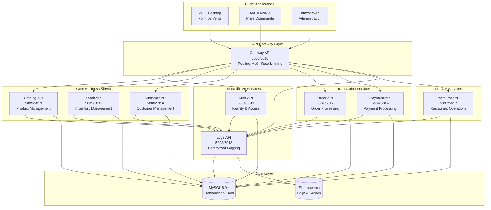
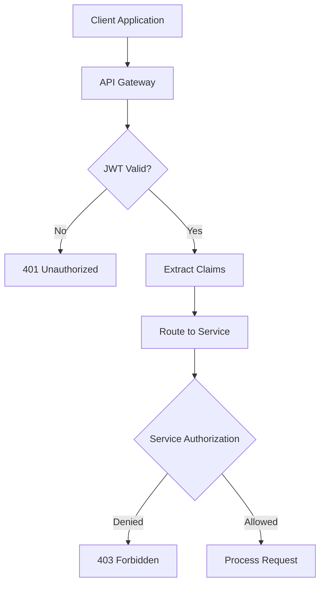

# 🏗️ ARCHITECTURE MICROSERVICES - NIESPRO ERP

*Architecture technique complète - 25 Septembre 2025*

---

## 🎯 **VISION ARCHITECTURALE**

### **📊 Principes Fondamentaux**

NiesPro ERP est conçu selon les principes d'une **architecture microservices native cloud** garantissant :
- **Scalabilité horizontale** - Chaque service scale indépendamment
- **Résilience** - Failure isolation et circuit breakers
- **Déployabilité** - Déploiement indépendant par service
- **Maintenabilité** - Code découplé et responsabilités claires
- **Observabilité** - Logging, monitoring et tracing complets

### **🔧 Stack Technique Enterprise**

| Couche | Technologie | Justification |
|--------|------------|---------------|
| **Runtime** | .NET 8 | Performance, sécurité, écosystème riche |
| **Framework** | ASP.NET Core | APIs REST optimisées, middleware pipeline |
| **ORM** | Entity Framework Core | Code-first, migrations, performance |
| **Base de Données** | MySQL 8.0+ | ACID, performance, clustering |
| **Recherche** | Elasticsearch | Full-text search, analytics logs |
| **CQRS** | MediatR | Séparation commandes/requêtes |
| **Authentication** | JWT Bearer | Stateless, scalable, sécurisé |
| **Logging** | Serilog | Structured logging, multiple sinks |

---

## 🏛️ **ARCHITECTURE GLOBALE**

### **📊 Vue d'Ensemble Système**



---

## 🔧 **ARCHITECTURE PAR SERVICE**

### **🎯 Clean Architecture Pattern**

Tous les services suivent rigoureusement le pattern **Clean Architecture** :

```
Service/
├── Service.Domain/          # Entités métier, Value Objects, Enums
├── Service.Application/     # Use Cases, DTOs, CQRS Handlers  
├── Service.Infrastructure/  # Repositories, External Services, DbContext
└── Service.API/            # Controllers, Middleware, Configuration
```

### **📋 Détail par Couche**

#### **1. Domain Layer (Cœur Métier)**
```csharp
// Entités avec logique métier
public class Product : BaseEntity
{
    public ProductName Name { get; private set; }
    public Money Price { get; private set; }
    public StockQuantity Stock { get; private set; }
    
    // Logique métier encapsulée
    public void UpdatePrice(Money newPrice, UserId updatedBy)
    {
        if (newPrice.Amount <= 0)
            throw new InvalidPriceException();
            
        AddDomainEvent(new ProductPriceUpdated(Id, Price, newPrice, updatedBy));
        Price = newPrice;
    }
}

// Value Objects
public record ProductName
{
    public string Value { get; }
    
    public ProductName(string value)
    {
        if (string.IsNullOrWhiteSpace(value))
            throw new ArgumentException("Product name cannot be empty");
        Value = value.Trim();
    }
}
```

#### **2. Application Layer (Use Cases)**
```csharp
// Command avec validation
public record CreateProductCommand : IRequest<Guid>
{
    public string Name { get; init; }
    public decimal Price { get; init; }
    public int InitialStock { get; init; }
}

// Handler CQRS
public class CreateProductHandler : IRequestHandler<CreateProductCommand, Guid>
{
    private readonly IProductRepository _repository;
    private readonly IUnitOfWork _unitOfWork;
    
    public async Task<Guid> Handle(CreateProductCommand request, CancellationToken ct)
    {
        var product = Product.Create(
            new ProductName(request.Name),
            new Money(request.Price),
            new StockQuantity(request.InitialStock)
        );
        
        await _repository.AddAsync(product);
        await _unitOfWork.SaveChangesAsync(ct);
        
        return product.Id;
    }
}
```

#### **3. Infrastructure Layer (Technique)**
```csharp
// Repository avec patterns avancés
public class ProductRepository : GenericRepository<Product>, IProductRepository
{
    public async Task<Product?> GetBySkuAsync(string sku)
    {
        return await _context.Products
            .Where(p => p.Sku == sku)
            .Include(p => p.Categories)
            .FirstOrDefaultAsync();
    }
    
    public async Task<PagedResult<Product>> GetPagedAsync(ProductFilter filter)
    {
        var query = _context.Products.AsQueryable();
        
        if (!string.IsNullOrEmpty(filter.Name))
            query = query.Where(p => p.Name.Value.Contains(filter.Name));
            
        return await query.ToPagedResultAsync(filter.Page, filter.Size);
    }
}

// DbContext avec configuration avancée
public class CatalogDbContext : DbContext
{
    protected override void OnModelCreating(ModelBuilder builder)
    {
        builder.ApplyConfigurationsFromAssembly(typeof(CatalogDbContext).Assembly);
        
        // Configuration Value Objects
        builder.Entity<Product>().OwnsOne(p => p.Name, n =>
        {
            n.Property(x => x.Value).HasColumnName("Name").IsRequired();
        });
    }
}
```

#### **4. API Layer (Interface)**
```csharp
[ApiController]
[Route("api/[controller]")]
[Authorize]
public class ProductsController : ControllerBase
{
    private readonly IMediator _mediator;
    private readonly IMapper _mapper;
    
    [HttpPost]
    [ProducesResponseType(typeof(Guid), 201)]
    [ProducesResponseType(400)]
    public async Task<IActionResult> Create([FromBody] CreateProductDto dto)
    {
        var command = _mapper.Map<CreateProductCommand>(dto);
        var productId = await _mediator.Send(command);
        
        return CreatedAtAction(nameof(GetById), new { id = productId }, productId);
    }
    
    [HttpGet("{id}")]
    [ProducesResponseType(typeof(ProductDto), 200)]
    [ProducesResponseType(404)]
    public async Task<IActionResult> GetById(Guid id)
    {
        var query = new GetProductByIdQuery(id);
        var product = await _mediator.Send(query);
        
        return product != null ? Ok(_mapper.Map<ProductDto>(product)) : NotFound();
    }
}
```

---

## 🔐 **SÉCURITÉ ENTERPRISE**

### **🛡️ Authentification Multi-Niveaux**



### **🔒 Implémentation Sécurité**

#### **JWT Configuration Standard**
```csharp
services.AddAuthentication(JwtBearerDefaults.AuthenticationScheme)
    .AddJwtBearer(options =>
    {
        options.TokenValidationParameters = new TokenValidationParameters
        {
            ValidateIssuer = true,
            ValidateAudience = true,
            ValidateLifetime = true,
            ValidateIssuerSigningKey = true,
            ValidIssuer = configuration["JWT:Issuer"],
            ValidAudience = configuration["JWT:Audience"],
            IssuerSigningKey = new SymmetricSecurityKey(
                Encoding.UTF8.GetBytes(configuration["JWT:Key"])),
            ClockSkew = TimeSpan.Zero
        };
    });
```

#### **Autorisation Granulaire**
```csharp
[Authorize(Policy = "CanManageProducts")]
public async Task<IActionResult> DeleteProduct(Guid id)
{
    // Vérification ownership
    if (!await _productService.UserCanModifyAsync(id, GetCurrentUserId()))
        return Forbid();
        
    await _mediator.Send(new DeleteProductCommand(id));
    return NoContent();
}
```

---

## 📊 **OBSERVABILITÉ COMPLÈTE**

### **🔍 Logging Structuré Obligatoire**

Tous les services utilisent **Serilog** avec enrichissement contextuel :

```csharp
Log.Logger = new LoggerConfiguration()
    .Enrich.FromLogContext()
    .Enrich.WithMachineName()
    .Enrich.WithProperty("Service", "Catalog.API")
    .WriteTo.Console()
    .WriteTo.Http("https://localhost:5018/api/logs", 
                  textFormatter: new JsonFormatter())
    .CreateLogger();
```

### **📈 Métriques Business**

```csharp
public async Task<IActionResult> ProcessOrder(CreateOrderDto dto)
{
    using var activity = _metrics.StartTimer("order_processing_duration");
    
    try
    {
        var order = await _mediator.Send(new CreateOrderCommand(dto));
        
        _metrics.Counter("orders_created_total")
               .WithTag("customer_type", order.CustomerType)
               .Increment();
               
        return Created($"/api/orders/{order.Id}", order);
    }
    catch (Exception ex)
    {
        _metrics.Counter("orders_failed_total")
               .WithTag("error_type", ex.GetType().Name)
               .Increment();
        throw;
    }
}
```

---

## 🔄 **PATTERNS DE COMMUNICATION**

### **📡 Communication Synchrone (REST)**

```csharp
// Service-to-Service avec Polly
services.AddHttpClient<ICatalogService, CatalogService>(client =>
{
    client.BaseAddress = new Uri("https://localhost:5013");
})
.AddPolicyHandler(GetRetryPolicy())
.AddPolicyHandler(GetCircuitBreakerPolicy());

private static IAsyncPolicy<HttpResponseMessage> GetRetryPolicy()
{
    return HttpPolicyExtensions
        .HandleTransientHttpError()
        .WaitAndRetryAsync(3, retryAttempt =>
            TimeSpan.FromSeconds(Math.Pow(2, retryAttempt)));
}
```

### **🚀 Communication Asynchrone (Events)**

```csharp
// Domain Events avec MediatR
public class ProductCreated : INotification
{
    public Guid ProductId { get; }
    public string ProductName { get; }
    public DateTime CreatedAt { get; }
}

public class ProductCreatedHandler : INotificationHandler<ProductCreated>
{
    public async Task Handle(ProductCreated notification, CancellationToken ct)
    {
        // Synchroniser avec service Stock
        await _stockService.CreateStockEntryAsync(notification.ProductId);
        
        // Notifier service Analytics
        await _analyticsService.TrackProductCreationAsync(notification);
    }
}
```

---

## 💾 **GESTION DES DONNÉES**

### **🎯 Base de Données par Service**

| Service | Base | Tables | Volume Estimé | Stratégie Backup |
|---------|------|--------|---------------|------------------|
| **Auth** | niespro_auth | 8 | 1M users | Quotidien + WAL |
| **Catalog** | niespro_catalog | 12 | 100k products | Quotidien |
| **Stock** | NiesPro_Stock | 6 | 10M movements | Quotidien + Archives |
| **Order** | NiesPro_Order | 15 | 2M orders | Temps réel |
| **Payment** | NiesPro_Payment | 8 | 2M transactions | Temps réel + Audit |

### **🔄 Migrations et Versioning**

```csharp
// Migrations automatisées
public class InitialCreate : Migration
{
    protected override void Up(MigrationBuilder migrationBuilder)
    {
        migrationBuilder.CreateTable(
            name: "Products",
            columns: table => new
            {
                Id = table.Column<Guid>(nullable: false),
                Name = table.Column<string>(maxLength: 200, nullable: false),
                Price = table.Column<decimal>(type: "decimal(18,2)", nullable: false),
                CreatedAt = table.Column<DateTime>(nullable: false)
            },
            constraints: table =>
            {
                table.PrimaryKey("PK_Products", x => x.Id);
            });
    }
}
```

---

## 🚀 **DÉPLOIEMENT ET SCALABILITÉ**

### **📦 Containerisation Docker**

```dockerfile
FROM mcr.microsoft.com/dotnet/aspnet:8.0 AS base
WORKDIR /app
EXPOSE 5003
EXPOSE 5013

FROM mcr.microsoft.com/dotnet/sdk:8.0 AS build
WORKDIR /src
COPY ["Catalog.API/Catalog.API.csproj", "Catalog.API/"]
RUN dotnet restore "Catalog.API/Catalog.API.csproj"

COPY . .
WORKDIR "/src/Catalog.API"
RUN dotnet build "Catalog.API.csproj" -c Release -o /app/build

FROM build AS publish
RUN dotnet publish "Catalog.API.csproj" -c Release -o /app/publish

FROM base AS final
WORKDIR /app
COPY --from=publish /app/publish .
ENTRYPOINT ["dotnet", "Catalog.API.dll"]
```

### **⚖️ Load Balancing et High Availability**

```yaml
# docker-compose.production.yml
version: '3.8'
services:
  catalog-api-1:
    image: niespro/catalog-api:latest
    environment:
      - ASPNETCORE_ENVIRONMENT=Production
    ports:
      - "5003:5003"
    
  catalog-api-2:
    image: niespro/catalog-api:latest
    environment:
      - ASPNETCORE_ENVIRONMENT=Production
    ports:
      - "5023:5003"
      
  nginx:
    image: nginx:alpine
    ports:
      - "80:80"
    volumes:
      - ./nginx.conf:/etc/nginx/nginx.conf
```

---

## 📊 **MÉTRIQUES DE PERFORMANCE**

### **🎯 SLA par Service**

| Service | Availability | Latency P95 | Throughput | Error Rate |
|---------|-------------|-------------|------------|------------|
| Gateway | 99.9% | < 50ms | 10k/s | < 0.1% |
| Auth | 99.9% | < 100ms | 5k/s | < 0.1% |
| Catalog | 99.5% | < 200ms | 3k/s | < 0.5% |
| Order | 99.9% | < 500ms | 1k/s | < 0.1% |
| Payment | 99.99% | < 1s | 500/s | < 0.01% |

### **📈 Monitoring et Alerting**

```csharp
// Health Checks avancés
services.AddHealthChecks()
    .AddDbContextCheck<CatalogDbContext>()
    .AddUrlGroup(new Uri("https://localhost:5018/health"), "logs-service")
    .AddCheck<BusinessLogicHealthCheck>("business-rules")
    .AddCheck<ExternalApiHealthCheck>("external-dependencies");
```

---

**🏆 Cette architecture microservices garantit une solution enterprise scalable, résiliente et maintenable pour les besoins critiques de NiesPro ERP.**