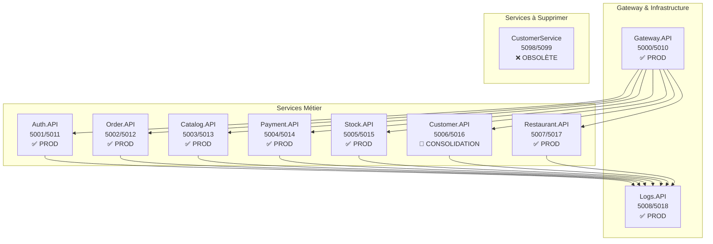

# 🎯 DOCUMENTATION CENTRALE - NIESPRO ERP v2024.9

*Documentation complète et unifiée - Mise à jour 25 Septembre 2025*

---

## 📚 **INDEX DE DOCUMENTATION**

### **📋 DOCUMENTS DE RÉFÉRENCE ACTUALISÉS**
| Document | Statut | Description | Dernière MAJ |
|----------|--------|-------------|-------------|
| **[CAHIER-CHARGES-UNIFIÉ](./CAHIER-CHARGES-UNIFIE.md)** | ✅ **ACTUEL** | Spécifications complètes du projet | 25/09/2025 |
| **[ARCHITECTURE-MICROSERVICES](./ARCHITECTURE-MICROSERVICES.md)** | ✅ **ACTUEL** | Architecture technique détaillée | 25/09/2025 |
| **[SERVICES-MATRIX](./SERVICES-MATRIX.md)** | ✅ **ACTUEL** | Matrice des services et dépendances | 25/09/2025 |
| **[INTEGRATION-LOGS-OBLIGATOIRE](./INTEGRATION-LOGS-OBLIGATOIRE.md)** | ✅ **ACTUEL** | Logging centralisé obligatoire | 25/09/2025 |
| **[CONFIGURATION-FINALE](./CONFIGURATION-FINALE.md)** | ✅ **ACTUEL** | Configuration ports et environnement | 25/09/2025 |
| **[STANDARDS-DEVELOPPEMENT](./STANDARDS-DEVELOPPEMENT.md)** | ✅ **ACTUEL** | Standards de code et bonnes pratiques | 25/09/2025 |

### **🧹 NETTOYAGE & QUALITÉ**
| Document | Type | Description | Dernière MAJ |
|----------|------|-------------|-------------|
| **[NETTOYAGE-DOCUMENTATION](./NETTOYAGE-DOCUMENTATION.md)** | 🧹 **RAPPORT** | Rapport complet de nettoyage documentation | 25/09/2025 |

### **🗑️ DOCUMENTS OBSOLÈTES SUPPRIMÉS (8 documents)**
✅ **Suppression effectuée** - Documentation propre et unifiée - Voir [NETTOYAGE-DOCUMENTATION.md](./NETTOYAGE-DOCUMENTATION.md) pour détails

---

## 🏗️ **ARCHITECTURE PROJET UNIFIÉE**

### **📊 Vue d'Ensemble - Services Production**



### **🎯 Statut Services - Septembre 2025**

| Service | Port HTTP/HTTPS | Base | Statut | Actions Requises |
|---------|-----------------|------|--------|------------------|
| **Gateway.API** | 5000/5010 | Proxy | ✅ **PRODUCTION** | - |
| **Auth.API** | 5001/5011 | niespro_auth | ✅ **PRODUCTION** | Intégration Logs |
| **Order.API** | 5002/5012 | NiesPro_Order | ✅ **PRODUCTION** | Intégration Logs |
| **Catalog.API** | 5003/5013 | niespro_catalog | ✅ **PRODUCTION** | Intégration Logs |
| **Payment.API** | 5004/5014 | NiesPro_Payment | ✅ **PRODUCTION** | Intégration Logs |
| **Stock.API** | 5005/5015 | NiesPro_Stock | ✅ **PRODUCTION** | Intégration Logs |
| **Customer.API** | 5006/5016 | NiesPro_Customer | 🚧 **CONSOLIDATION** | Supprimer duplication |
| **Restaurant.API** | 5007/5017 | NiesPro_Restaurant | ✅ **PRODUCTION** | Intégration Logs |
| **Logs.API** | 5008/5018 | NiesPro_Logs | ✅ **PRODUCTION** | - |
| ❌ **CustomerService** | 5098/5099 | NiesPro_Customer | ❌ **À SUPPRIMER** | Migration → Customer.API |

---

## 🔄 **ROADMAP DE DÉVELOPPEMENT**

### **Phase 1 - Consolidation Infrastructure (EN COURS)**
- ✅ Service Logs/Audit créé et opérationnel
- 🚧 Consolidation Customer (supprimer duplication CustomerService)
- 🚧 Intégration obligatoire Logs dans tous services
- ⏳ Tests d'intégration complets

### **Phase 2 - Services Business Avancés (PROCHAINE)**
- ⏳ Notification Service (Email/SMS/WhatsApp)
- ⏳ Report Service (Reporting et analytics)
- ⏳ Integration Service (APIs externes)
- ⏳ Backup Service (Sauvegarde automatisée)

### **Phase 3 - Optimisation et Scalabilité**
- ⏳ Cache distribué (Redis)
- ⏳ Event Sourcing avancé
- ⏳ Monitoring avancé (Grafana/Prometheus)
- ⏳ Tests de charge et performance

---

## 📋 **STANDARDS OBLIGATOIRES**

### **🏗️ Clean Architecture**
- **Domain Layer** : Entités, Value Objects, Enums
- **Application Layer** : Use Cases, DTOs, CQRS (MediatR)
- **Infrastructure Layer** : Repositories, External Services, DbContext
- **API Layer** : Controllers, Middleware, Configuration

### **🔒 Sécurité**
- **JWT Authentication** obligatoire sur tous endpoints
- **CORS** configuré strictement
- **Rate Limiting** implémenté
- **Validation** systématique des inputs
- **HTTPS** obligatoire en production

### **📊 Logging & Monitoring**
- **Serilog** avec sink HTTP vers Logs.API
- **Audit automatique** de toutes actions CUD
- **Métriques performance** sur endpoints critiques
- **Alertes système** sur conditions critiques
- **Health checks** sur tous services

### **🧪 Tests**
- **Unit Tests** (couverture > 80%)
- **Integration Tests** pour repositories et APIs
- **End-to-End Tests** pour workflows critiques
- **Performance Tests** sur endpoints business

---

## 🛠️ **OUTILS ET TECHNOLOGIES**

### **Backend**
- **.NET 8** - Framework principal
- **ASP.NET Core Web API** - Services REST
- **Entity Framework Core** - ORM avec MySQL
- **MediatR** - Pattern CQRS
- **AutoMapper** - Mapping objets
- **Serilog** - Logging structuré
- **JWT** - Authentification stateless

### **Base de Données**
- **MySQL 8.0+** - Base principale
- **Elasticsearch** - Recherche et analytics logs
- **Redis** (futur) - Cache distribué

### **Infrastructure**
- **Docker** - Containerisation
- **NGINX** (futur) - Reverse proxy
- **CI/CD GitHub Actions** - Pipeline automatisé

---

## 🚀 **DÉMARRAGE RAPIDE**

### **1. Prérequis**
```bash
# Installer .NET 8 SDK
winget install Microsoft.DotNet.SDK.8

# Installer MySQL 8.0
winget install Oracle.MySQL

# Cloner le repository
git clone https://github.com/mikaelarthservices-ux/NiesPro.git
cd NiesPro
```

### **2. Configuration Base de Données**
```bash
# Démarrer MySQL
net start mysql80

# Créer les bases (script automatisé disponible)
.\scripts\setup-databases.ps1
```

### **3. Démarrage Services**
```bash
# Démarrer tous les services
.\start-all-services.ps1

# Ou service par service
dotnet run --project src/Services/Gateway/Gateway.API
dotnet run --project src/Services/Auth/Auth.API
dotnet run --project src/Services/Logs/Logs.API
```

### **4. Vérification**
- **Gateway** : https://localhost:5010/swagger
- **Auth** : https://localhost:5011/swagger  
- **Logs** : https://localhost:5018/swagger
- **Health Checks** : https://localhost:5010/health

---

## 📞 **SUPPORT ET CONTRIBUTION**

### **Équipe Développement**
- **Architecture** : Définition des patterns et standards
- **Backend** : Développement des microservices
- **Frontend** : Applications client (WPF/MAUI/Blazor)
- **DevOps** : Infrastructure et déploiement

### **Processus de Développement**
1. **Issue** créée avec spécifications détaillées
2. **Branch feature** créée depuis `main`
3. **Développement** avec tests obligatoires
4. **Code Review** avec validation architecture
5. **Merge** après validation complète

### **Standards Qualité**
- ✅ **Code Review** obligatoire
- ✅ **Tests** unitaires et intégration  
- ✅ **Documentation** mise à jour
- ✅ **Performance** validée
- ✅ **Sécurité** vérifiée

---

## 📜 **LICENCE ET PROPRIÉTÉ**

**© 2024 NiesPro - Tous droits réservés**

Projet propriétaire développé par l'équipe NiesPro. Toute reproduction, distribution ou utilisation commerciale est strictement interdite sans autorisation écrite.

---

**🎯 Cette documentation est maintenue en permanence et reflète l'état actuel du projet NiesPro ERP.**