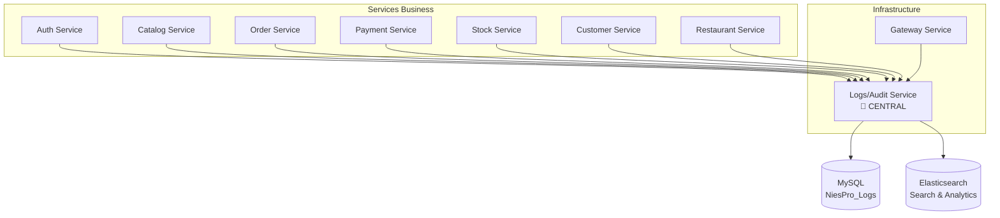

# 🎯 INTÉGRATION OBLIGATOIRE SERVICE LOGS/AUDIT - NIESPRO

*Stratégie d'intégration transversale - 25 Septembre 2025*

---

## ⚡ **PRINCIPE FONDAMENTAL**

> **TOUS les microservices DOIVENT obligatoirement intégrer le service Logs/Audit**

**Aucun service ne peut fonctionner en production sans logging centralisé !**

---

## 🏗️ **ARCHITECTURE D'INTÉGRATION**

### **📊 Flux de Logging Centralisé**



---

## 🔧 **INTÉGRATION TECHNIQUE STANDARDISÉE**

### **1. 📦 Package NuGet Commun**

**Créer un package partagé :**
```xml
<PackageReference Include="NiesPro.Logging.Client" Version="1.0.0" />
```

### **2. 🛠️ Configuration Standard par Service**

**appsettings.json (identique pour tous) :**
```json
{
  "Logging": {
    "LogLevel": {
      "Default": "Information",
      "Microsoft.AspNetCore": "Warning"
    }
  },
  "Serilog": {
    "MinimumLevel": "Information",
    "WriteTo": [
      {
        "Name": "Console"
      },
      {
        "Name": "Http",
        "Args": {
          "requestUri": "https://localhost:5018/api/logs",
          "queueLimitBytes": null,
          "textFormatter": "Serilog.Formatting.Json.JsonFormatter, Serilog"
        }
      }
    ]
  },
  "LogsService": {
    "BaseUrl": "https://localhost:5018",
    "ApiKey": "your-api-key-here",
    "ServiceName": "Auth.API", // <- Unique par service
    "RetryAttempts": 3,
    "TimeoutSeconds": 30
  }
}
```

### **3. 💉 Injection de Dépendance Standardisée**

**Program.cs (template identique) :**
```csharp
using Serilog;
using NiesPro.Logging.Client;

var builder = WebApplication.CreateBuilder(args);

// Configuration Serilog obligatoire
builder.Host.UseSerilog((context, configuration) =>
    configuration.ReadFrom.Configuration(context.Configuration));

// Injection client Logs obligatoire  
builder.Services.AddLogsServiceClient(builder.Configuration);
builder.Services.AddAuditServiceClient(builder.Configuration);

var app = builder.Build();

// Middleware logging obligatoire
app.UseLoggingMiddleware();
app.UseAuditMiddleware();

app.Run();
```

---

## 🎯 **UTILISATIONS OBLIGATOIRES**

### **📋 1. Logs Applicatifs (OBLIGATOIRE)**

**Tous les services DOIVENT logger :**

```csharp
public class ProductController : ControllerBase
{
    private readonly ILogger<ProductController> _logger;
    
    [HttpGet]
    public async Task<IActionResult> GetProducts()
    {
        _logger.LogInformation("Récupération des produits - Utilisateur: {UserId}", GetCurrentUserId());
        
        try
        {
            var products = await _productService.GetProductsAsync();
            
            _logger.LogInformation("Produits récupérés avec succès - Nombre: {Count}", products.Count());
            
            return Ok(products);
        }
        catch (Exception ex)
        {
            _logger.LogError(ex, "Erreur lors de la récupération des produits");
            throw;
        }
    }
}
```

### **🔒 2. Audit Trail (OBLIGATOIRE)**

**Tous les CUD (Create, Update, Delete) DOIVENT être audités :**

```csharp
public class ProductService : IProductService
{
    private readonly IAuditService _auditService;
    
    public async Task<Product> CreateProductAsync(CreateProductDto dto)
    {
        var product = new Product(dto.Name, dto.Price);
        await _repository.AddAsync(product);
        
        // AUDIT OBLIGATOIRE
        await _auditService.LogAuditAsync(new AuditEntry
        {
            UserId = GetCurrentUserId(),
            UserName = GetCurrentUserName(),
            Action = "CREATE_PRODUCT",
            ActionType = AuditActionType.Create,
            EntityName = "Product",
            EntityId = product.Id.ToString(),
            ServiceName = "Catalog.API",
            Metadata = new Dictionary<string, object>
            {
                { "ProductName", product.Name },
                { "Price", product.Price }
            }
        });
        
        return product;
    }
}
```

### **📊 3. Métriques Performance (OBLIGATOIRE)**

**Tous les endpoints critiques DOIVENT mesurer leurs performances :**

```csharp
public class PaymentController : ControllerBase
{
    private readonly IMetricsService _metricsService;
    
    [HttpPost("process")]
    public async Task<IActionResult> ProcessPayment(PaymentDto dto)
    {
        using var timer = _metricsService.StartTimer("payment_processing_duration");
        
        try
        {
            var result = await _paymentService.ProcessAsync(dto);
            
            // Métrique succès
            await _metricsService.RecordMetricAsync("payment_success_count", 1, MetricType.Counter);
            
            return Ok(result);
        }
        catch (Exception ex)
        {
            // Métrique erreur
            await _metricsService.RecordMetricAsync("payment_error_count", 1, MetricType.Counter);
            throw;
        }
    }
}
```

### **🚨 4. Alertes Système (OBLIGATOIRE)**

**Conditions critiques DOIVENT déclencher des alertes :**

```csharp
public class StockService : IStockService
{
    private readonly IAlertService _alertService;
    
    public async Task UpdateStockAsync(Guid productId, int quantity)
    {
        var currentStock = await _repository.GetStockAsync(productId);
        var newStock = currentStock + quantity;
        
        // ALERTE OBLIGATOIRE - Stock critique
        if (newStock <= 10)
        {
            await _alertService.CreateAlertAsync(new SystemAlert
            {
                Title = "Stock Critique",
                Description = $"Stock produit {productId} critique: {newStock} unités",
                Severity = AlertSeverity.High,
                ServiceName = "Stock.API",
                Context = new Dictionary<string, object>
                {
                    { "ProductId", productId },
                    { "CurrentStock", newStock },
                    { "Threshold", 10 }
                }
            });
        }
    }
}
```

---

## 🔄 **MIDDLEWARE AUTOMATISÉ (OBLIGATOIRE)**

### **📡 Middleware de Logging Automatique**

```csharp
public class LoggingMiddleware
{
    public async Task InvokeAsync(HttpContext context, RequestDelegate next)
    {
        var correlationId = Guid.NewGuid().ToString();
        context.Items["CorrelationId"] = correlationId;
        
        // Log entrée requête
        _logger.LogInformation("Requête reçue: {Method} {Path} - CorrelationId: {CorrelationId}", 
            context.Request.Method, context.Request.Path, correlationId);
        
        var stopwatch = Stopwatch.StartNew();
        
        try
        {
            await next(context);
            
            // Log succès
            _logger.LogInformation("Requête terminée: {StatusCode} en {Duration}ms", 
                context.Response.StatusCode, stopwatch.ElapsedMilliseconds);
        }
        catch (Exception ex)
        {
            // Log erreur
            _logger.LogError(ex, "Erreur requête: {Method} {Path}", 
                context.Request.Method, context.Request.Path);
            throw;
        }
    }
}
```

---

## 📋 **CHECKLIST D'INTÉGRATION OBLIGATOIRE**

### **✅ Pour Chaque Service :**

- [ ] **Serilog configuré** avec HTTP sink vers Logs service
- [ ] **Client Logs/Audit injecté** via DI
- [ ] **Middleware logging** activé sur tous endpoints
- [ ] **Logs applicatifs** sur toutes les méthodes critiques
- [ ] **Audit trail** sur tous les CUD operations
- [ ] **Métriques performance** sur endpoints business
- [ ] **Alertes système** sur conditions critiques
- [ ] **Configuration standardisée** dans appsettings.json
- [ ] **Health checks** incluant Logs service
- [ ] **Tests d'intégration** avec Logs service

### **🚨 Contrôles Qualité :**

- [ ] **Aucun service ne démarre** sans connexion Logs
- [ ] **Build pipeline vérifie** intégration Logs
- [ ] **Code reviews** valident logging obligatoire
- [ ] **Monitoring** surveille flux de logs

---

## 🎯 **GOUVERNANCE ET STANDARDS**

### **📜 Règles Non-Négociables :**

1. **TOUT service DOIT utiliser Serilog** avec HTTP sink
2. **TOUTE action CUD DOIT être auditée** automatiquement  
3. **TOUTE erreur DOIT être loggée** avec contexte complet
4. **TOUT endpoint critique DOIT mesurer** ses performances
5. **TOUTE condition critique DOIT alerter** le système

### **🔍 Contrôles Automatisés :**

- **Pipeline CI/CD** refuse deployment sans logging
- **Sonar** détecte code sans logs obligatoires
- **Monitoring** alerte sur services "silencieux"
- **Health checks** incluent connectivité Logs service

---

## 🚀 **BÉNÉFICES DE L'APPROCHE OBLIGATOIRE**

### **✅ Avantages Immédiats :**
- **Visibilité complète** sur l'écosystème
- **Debugging unifié** et centralisé
- **Compliance automatique** et traçabilité
- **Monitoring proactif** des performances
- **Détection précoce** des problèmes

### **🎯 Résultat Final :**
**Un ERP complètement transparent, traceable et monitoré !**

---

## 📋 **PROCHAINES ÉTAPES D'IMPLÉMENTATION**

### **Phase 1 - Standardisation (1 semaine)**
1. ✅ Créer package NuGet `NiesPro.Logging.Client`
2. ✅ Créer templates configuration standardisée
3. ✅ Créer middleware automatisé
4. ✅ Documentation développeur complète

### **Phase 2 - Migration Services (2 semaines)**  
1. ✅ Migrer Auth service (référence)
2. ✅ Migrer Catalog service
3. ✅ Migrer tous autres services
4. ✅ Tests d'intégration complets

### **Phase 3 - Validation (1 semaine)**
1. ✅ Tests charge avec logging complet
2. ✅ Validation dashboard monitoring
3. ✅ Formation équipes développement
4. ✅ Documentation opérationnelle

---

**🎯 CONCLUSION : Le service Logs/Audit devient le "cœur battant" de votre ERP - sans lui, aucun service ne peut vivre !**