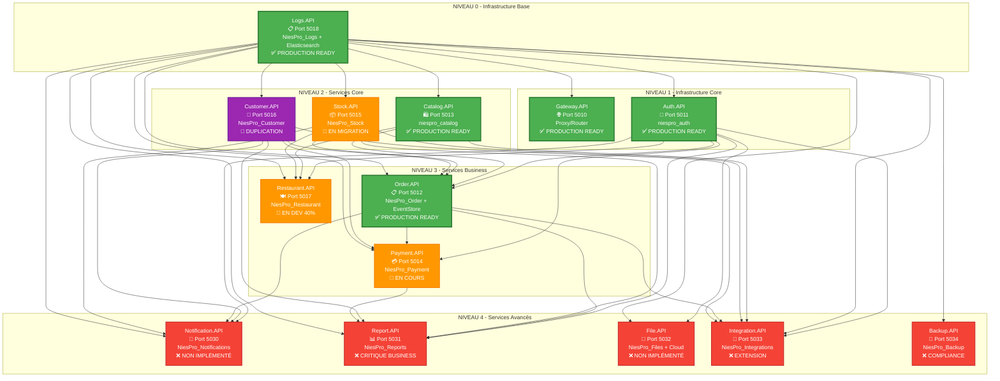

# 📊 **SCHÉMA VISUEL DES DÉPENDANCES - NIESPRО ERP**

**Architecture Microservices** : .NET 8 + MySQL + Clean Architecture

---

## 🏗️ **DIAGRAMME DES DÉPENDANCES PAR NIVEAUX**



---

## 📋 **LÉGENDE DES STATUTS**

| Couleur | Status | Description |
|---------|--------|-------------|
| 🟢 **Vert** | **PRODUCTION READY** | Service opérationnel avec tests complets |
| 🟠 **Orange** | **EN COURS** | Service en développement ou migration |
| 🔴 **Rouge** | **NON IMPLÉMENTÉ** | Service planifié mais pas encore développé |
| 🟣 **Violet** | **DUPLICATION** | Problème architectural à résoudre |

---

## 🔗 **MATRICE DES DÉPENDANCES DÉTAILLÉE**

### **📊 Table des Relations**

| Service Source | Dépendances Directes | Type de Relation | Criticité |
|---------------|---------------------|------------------|-----------|
| **Logs.API** | AUCUNE | Infrastructure | 🟢 FONDATION |
| **Gateway.API** | Logs.API | Proxy | 🟢 CRITIQUE |
| **Auth.API** | Logs.API | Audit | 🟢 CRITIQUE |
| **Catalog.API** | Logs.API | Audit | 🟢 AUTONOME |
| **Stock.API** | Logs.API | Audit | 🟠 AUTONOME |
| **Customer.API** | Logs.API | Audit | 🟣 DUPLICATION |
| **Restaurant.API** | Auth + Catalog + Stock + Logs | Business | 🟠 COMPLEXE |
| **Order.API** | Auth + Catalog + Stock + Customer + Logs | Business | 🟢 COMPLEXE |
| **Payment.API** | Auth + Order + Customer + Logs | Business | 🟠 COMPLEXE |
| **Notification.API** | Auth + Customer + Order + Stock + Logs | Support | 🔴 MULTI-DEPS |
| **Report.API** | Auth + Order + Stock + Customer + Payment + Logs | Analytics | 🔴 MULTI-DEPS |
| **File.API** | Auth + Logs | Utility | 🔴 SIMPLE |
| **Integration.API** | Tous services métier + Logs | Extension | 🔴 COMPLEXE |
| **Backup.API** | Tous services + Logs | Infrastructure | 🔴 GLOBAL |

---

## 🎯 **ORDRE D'IMPLÉMENTATION OPTIMAL**

### **🚀 SÉQUENCE RECOMMANDÉE**

#### **Phase Actuelle - Consolidation** ✅
```
1. Logs.API        ✅ TERMINÉ
2. Gateway.API     ✅ TERMINÉ  
3. Auth.API        ✅ TERMINÉ
4. Catalog.API     ✅ TERMINÉ
5. Order.API       ✅ TERMINÉ
```

#### **Phase Urgente - Services Core** 🔥
```
6. Customer.API    🚨 RÉSOUDRE DUPLICATION
7. Stock.API       🔄 FINALISER MIGRATION  
8. Payment.API     🔄 CORRIGER WARNINGS
```

#### **Phase Business - Services Métier** 📈
```
9. Restaurant.API   🔄 COMPLÉTER DÉVELOPPEMENT
10. Report.API      ❌ CRITIQUE BUSINESS
11. Notification.API ❌ EXPÉRIENCE UTILISATEUR
```

#### **Phase Extension - Services Avancés** 🚀
```
12. File.API        ❌ GESTION DOCUMENTS
13. Integration.API ❌ APIS EXTERNES  
14. Backup.API      ❌ COMPLIANCE
```

---

## ⚡ **POINTS DE BLOCAGE IDENTIFIÉS**

### **🚨 BLOQUANTS CRITIQUES**
1. **Customer Duplication** : Empêche finalisation Order.API et Payment.API
2. **Stock.API Migration** : Requis par Restaurant.API et Order.API  
3. **Payment.API Warnings** : 20 warnings de compilation à corriger

### **📋 DÉPENDANCES CRITIQUES**
- **Order.API** dépend de 5 services (plus complexe)
- **Payment.API** dépend de Order.API (cascade)
- **Report.API** dépend de tous les services métier

### **🎯 CHEMIN CRITIQUE**
```
Customer.API (résolution duplication) 
    ↓
Order.API (finalisation complète)
    ↓  
Payment.API (correction warnings)
    ↓
Restaurant.API (développement métier)
    ↓
Report.API (analytics business)
```

---

## 📊 **IMPACT ANALYSE**

### **🎯 Services à Impact Élevé**
- **Logs.API** : Impact sur 100% des services (fondation)
- **Auth.API** : Impact sur tous services business (sécurité)
- **Order.API** : Impact sur Payment et Report (workflow central)

### **🔗 Services Fortement Couplés**  
- **Order ↔ Payment** : Workflow transactionnel
- **Restaurant → Catalog + Stock** : Gestion ingrédients
- **Report → Tous** : Agrégation de données

### **⚡ Services Autonomes**
- **Catalog.API** : Peut fonctionner indépendamment
- **File.API** : Service utility standalone
- **Backup.API** : Infrastructure indépendante

---

**🏗️ Cette architecture respecte les principes microservices avec une séparation claire des responsabilités et une évolutivité maximale.**