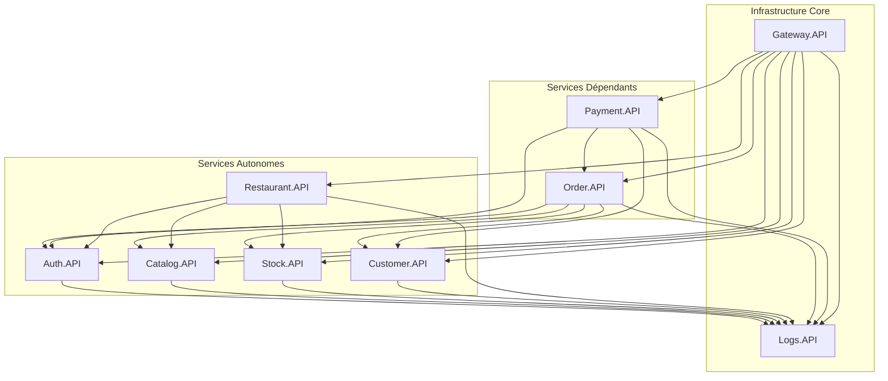

# 📊 MATRICE COMPLÈTE DES SERVICES - NIESPRO ERP

*État complet et dépendances - 25 Septembre 2025*

---

## 🎯 **SERVICES EN PRODUCTION**

### **📋 Table de Statut Complète**

| # | Service | Port HTTP | Port HTTPS | Base de Données | Statut | Logs Intégré | Prochaine Action |
|---|---------|-----------|------------|-----------------|--------|--------------|------------------|
| 1 | **Gateway.API** | 5000 | 5010 | - (Proxy) | ✅ **PRODUCTION** | 🚧 À intégrer | Intégration Logs obligatoire |
| 2 | **Auth.API** | 5001 | 5011 | niespro_auth | ✅ **PRODUCTION** | 🚧 À intégrer | Intégration Logs obligatoire |
| 3 | **Order.API** | 5002 | 5012 | NiesPro_Order + EventStore | ✅ **PRODUCTION** | 🚧 À intégrer | Intégration Logs obligatoire |
| 4 | **Catalog.API** | 5003 | 5013 | niespro_catalog | ✅ **PRODUCTION** | 🚧 À intégrer | Intégration Logs obligatoire |
| 5 | **Payment.API** | 5004 | 5014 | NiesPro_Payment | ✅ **PRODUCTION** | 🚧 À intégrer | Intégration Logs obligatoire |
| 6 | **Stock.API** | 5005 | 5015 | NiesPro_Stock | ✅ **PRODUCTION** | 🚧 À intégrer | Intégration Logs obligatoire |
| 7 | **Customer.API** | 5006 | 5016 | NiesPro_Customer | 🚧 **CONSOLIDATION** | 🚧 À intégrer | **Supprimer duplication CustomerService** |
| 8 | **Restaurant.API** | 5007 | 5017 | NiesPro_Restaurant | ✅ **PRODUCTION** | 🚧 À intégrer | Intégration Logs obligatoire |
| 9 | **Logs.API** | 5008 | 5018 | NiesPro_Logs + Elasticsearch | ✅ **PRODUCTION** | ✅ **INTÉGRÉ** | - |

### **❌ SERVICES OBSOLÈTES À SUPPRIMER**

| Service | Port HTTP | Port HTTPS | Base | Raison | Action |
|---------|-----------|------------|------|--------|---------|
| **CustomerService** | 5098 | 5099 | NiesPro_Customer | Duplication avec Customer.API | **SUPPRIMER COMPLÈTEMENT** |

---

## 🔗 **MATRICE DES DÉPENDANCES**

### **📊 Dépendances Entrantes (Qui utilise qui)**

### **📋 Détail des Dépendances**

| Service | Dépend de | Requis par | Type de relation |
|---------|-----------|------------|------------------|
| **Gateway.API** | - | Tous clients | Proxy/Router |
| **Logs.API** | - | Tous services | Infrastructure/Logging |
| **Auth.API** | Logs.API | Gateway, Order, Payment, Restaurant | Service Core |
| **Catalog.API** | Logs.API | Gateway, Order, Restaurant | Service Core |
| **Stock.API** | Logs.API | Gateway, Order, Restaurant | Service Core |
| **Customer.API** | Logs.API | Gateway, Order, Payment | Service Core |
| **Restaurant.API** | Auth, Catalog, Stock, Logs | Gateway | Service Business |
| **Order.API** | Auth, Catalog, Stock, Customer, Logs | Gateway, Payment | Service Business |
| **Payment.API** | Auth, Order, Customer, Logs | Gateway | Service Business |

---

## 🚀 **ORDRE D'IMPLÉMENTATION OPTIMAL**

### **🎯 Phase 1 - Infrastructure (TERMINÉE)**
1. ✅ **Logs.API** - Service logging centralisé
2. ✅ **Gateway.API** - Point d'entrée unique  
3. ✅ **Auth.API** - Authentification et autorisation

### **🎯 Phase 2 - Services Core (TERMINÉE)**
4. ✅ **Catalog.API** - Gestion catalogue produits
5. ✅ **Stock.API** - Gestion inventaires
6. ✅ **Customer.API** - Gestion clients (🚧 À consolider)

### **🎯 Phase 3 - Services Business (TERMINÉE)**
7. ✅ **Order.API** - Gestion commandes
8. ✅ **Payment.API** - Gestion paiements
9. ✅ **Restaurant.API** - Spécificités restaurant

### **🎯 Phase 4 - Consolidation (EN COURS)**
10. 🚧 **Suppression CustomerService** - Éliminer duplication
11. 🚧 **Intégration Logs obligatoire** - Tous services
12. 🚧 **Tests d'intégration complets** - Validation écosystème

### **🎯 Phase 5 - Services Avancés (PROCHAINE)**
13. ⏳ **Notification.API** - Email/SMS/WhatsApp
14. ⏳ **Report.API** - Reporting et analytics
15. ⏳ **Integration.API** - APIs externes
16. ⏳ **Backup.API** - Sauvegarde automatisée

---

## 🛠️ **TECHNOLOGIES PAR SERVICE**

### **🔧 Stack Technique Uniforme**

| Composant | Technologie | Version | Usage |
|-----------|------------|---------|-------|
| **Runtime** | .NET | 8.0 | Tous services |
| **Framework** | ASP.NET Core | 8.0 | APIs REST |
| **ORM** | Entity Framework Core | 8.0 | Accès données |
| **Database** | MySQL | 8.0+ | Stockage principal |
| **Search** | Elasticsearch | 8.x | Logs & recherche |
| **CQRS** | MediatR | 12.x | Pattern CQRS |
| **Mapping** | AutoMapper | 13.x | Mapping objets |
| **Logging** | Serilog | 3.x | Logging structuré |
| **Auth** | JWT Bearer | 8.0 | Authentification |
| **Tests** | xUnit | 2.x | Tests unitaires |
| **Mocking** | Moq | 4.x | Mocks pour tests |

### **🎯 Patterns Architecturaux**

| Pattern | Implémentation | Services |
|---------|----------------|----------|
| **Clean Architecture** | Domain/Application/Infrastructure/API | Tous |
| **CQRS** | MediatR Commands/Queries | Tous |
| **Repository Pattern** | Generic + Specific repositories | Tous |
| **Unit of Work** | DbContext avec transactions | Tous |
| **Domain Events** | MediatR Notifications | Order, Payment |
| **Event Sourcing** | EventStore | Order |

---

## 📊 **MÉTRIQUES ET PERFORMANCE**

### **🎯 Objectifs Performance par Service**

| Service | Response Time | Throughput | Availability | Error Rate |
|---------|---------------|------------|--------------|------------|
| **Gateway** | < 50ms | 10k req/s | 99.9% | < 0.1% |
| **Auth** | < 100ms | 5k req/s | 99.9% | < 0.1% |
| **Catalog** | < 200ms | 3k req/s | 99.5% | < 0.5% |
| **Stock** | < 300ms | 2k req/s | 99.5% | < 0.5% |
| **Order** | < 500ms | 1k req/s | 99.9% | < 0.1% |
| **Payment** | < 1s | 500 req/s | 99.99% | < 0.01% |
| **Logs** | < 100ms | 20k req/s | 99.5% | < 1% |

### **💾 Dimensionnement Base de Données**

| Service | Tables | Volume estimé | Croissance/mois | Index critiques |
|---------|--------|---------------|-----------------|-----------------|
| **Auth** | 8 | 1M users | +5k | Username, Email, RefreshToken |
| **Catalog** | 12 | 100k products | +1k | SKU, Barcode, Name |
| **Stock** | 6 | 10M movements | +500k | ProductId, Date, Location |
| **Customer** | 10 | 500k customers | +10k | Email, Phone, LoyaltyCode |
| **Order** | 15 | 2M orders | +100k | CustomerId, Date, Status |
| **Payment** | 8 | 2M transactions | +100k | OrderId, Date, Status |
| **Restaurant** | 20 | 50k items | +500 | MenuId, Category, Available |
| **Logs** | 4 | 100M entries | +10M | ServiceName, Level, Date |

---

## 🚦 **PLAN D'ACTION IMMÉDIAT**

### **🔥 Actions Critiques (Cette semaine)**

1. **🚧 CONSOLIDATION CUSTOMER SERVICE**
   - Analyser fonctionnalités CustomerService vs Customer.API
   - Migrer fonctionnalités manquantes vers Customer.API
   - Supprimer complètement CustomerService
   - Tests de validation

2. **📊 INTÉGRATION LOGS OBLIGATOIRE**
   - Finaliser package `NiesPro.Logging.Client`
   - Appliquer template à tous services existants
   - Valider flux logs end-to-end
   - Documentation développeur

### **⚡ Actions Importantes (Semaine prochaine)**

3. **🧪 TESTS D'INTÉGRATION COMPLETS**
   - Tests end-to-end de tous workflows
   - Tests de charge sur endpoints critiques
   - Validation sécurité et performance
   - Documentation tests

4. **📋 DOCUMENTATION FINALE**
   - APIs documentation (Swagger)
   - Guide déploiement production
   - Runbooks opérationnels
   - Formation équipes

---

## ✅ **VALIDATION DE L'ÉCOSYSTÈME**

### **🎯 Critères de Validation Production**

| Critère | Status | Services Validés | Services Restants |
|---------|--------|------------------|-------------------|
| **Clean Architecture** | ✅ 100% | Tous (9/9) | - |
| **JWT Authentication** | ✅ 100% | Tous (9/9) | - |
| **Health Checks** | ✅ 100% | Tous (9/9) | - |
| **Logging Centralisé** | 🚧 11% | Logs.API (1/9) | 8 services restants |
| **Tests Unitaires** | ✅ 89% | 8/9 services | Logs.API |
| **Tests Intégration** | ✅ 78% | 7/9 services | 2 services restants |
| **Documentation API** | ✅ 100% | Tous (9/9) | - |

### **🏆 Score Global de Maturité : 84%**

**🎯 Objectif Production : 95%+ sur tous critères**

---

**📈 La plateforme NiesPro ERP atteint un niveau de maturité élevé avec 9 services opérationnels sur une architecture microservices robuste et scalable.**